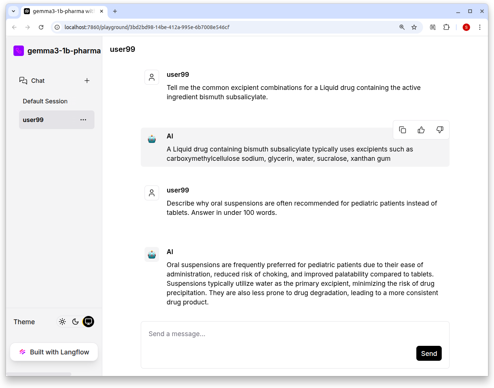
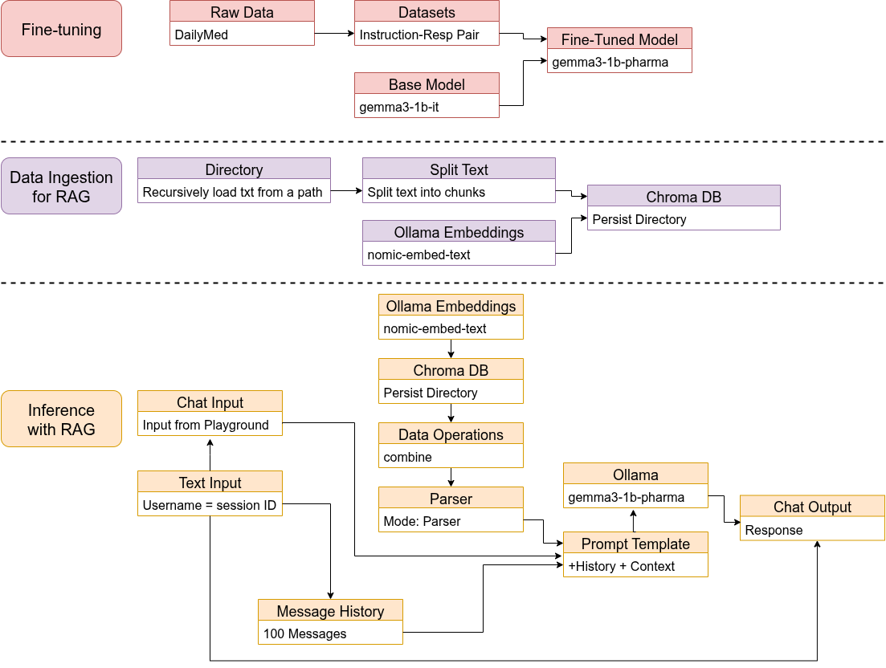
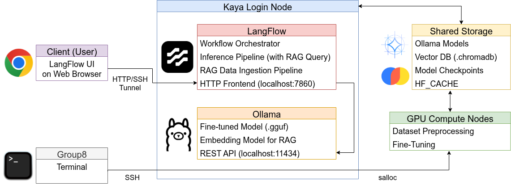

# CITS5553 Data Science Capstone Project (GROUP 8)

# AI-Driven Formulation Development for Pharmaceutical Applications
This repository contains the final project for the CITS5553 unit, focusing on leveraging artificial intelligence to optimize pharmaceutical formulation development. This project explores how large language models can be fine-tuned to predict optimal excipient combinations and formulation outcomes, moving beyond traditional trial-and-error methods.

## Core Components

* **Data Sources**: The project leverages external, domain-specific text data, primarily **DailyMed**, for specialized training and knowledge base construction.
* **Foundation Model**: The system utilizes the **google/gemma-3-1b-it** model as the foundational Large Language Model (LLM) for subsequent adaptation to the pharmaceutical domain.
* **Methodology**
  - **Fine-tuning**: The model was specialized using **Instruction-Response Pair Fine-tuning** to instill domain-specific reasoning and precise instruction-following capabilities.
  - **Retrieval-Augmented Generation (RAG)**: The system incorporates a RAG pipeline using a local vector database to provide the model with a structured knowledge base from domain-specific documents, enhancing its predictive accuracy.
* **Key Tasks**: The model is trained to perform three critical functions:
  - Optimization of excipient selection
  - Recommendation of candidate formulations
  - Prediction of formulation outcomes

## Key Feature Workflow

### File Structure

The project repository is organized into the following key directories:

* **clm/**: **Unsupervised Fine-tuning (Causal Language Modeling) - Failure and Lessons Learned**
    * `clm_training/`: Scripts and associated log files used for CLM training.
    * `data_prep/`: Code for downloading, sampling, and preprocessing PubMed and DailyMed XML data.
    * `evaluation/`: Code for conducting quantitative and qualitative evaluation specific to the CLM-trained model.
    * `clm_training_samples.tar.gz`: Archive containing 2,466 sample files for CLM training.
    * `gemma3-1b-it-clm-trained.tar.gz`: Archive containing the latest checkpoint from the CLM training run.

* **data/**: DailyMed Dataset for Fine-tuning
    * `full_database.csv`: A comprehensive CSV file extracted from the DailyMed Dataset, including critical pharmaceutical information such as Product, Dosage Form, Route, Active Ingredient, Active Strength, and Inactive Ingredients.
    * `train.txt`, `val.txt`, `test.txt`: The training, validation, and testing datasets generated from full_database.csv in the format of instruction-response pairs for supervised fine-tuning.

* **docs/**: Contains the project proposal, the final project report, and documentation including the user guide.

* **evaluation/**: Contains a script for comprehensive model evaluation/ Evaluates base, fine-tuned, and RAG-enhanced models using various metrics (BLEU, ROUGE, Cosine Similarity, Precision, Recall, Top-K Accuracy, and Perplexity) to assess both linguistic coherence and semantic performance.

* **fine-tuning/**: Contains a jupyter notebook file used for performing the instruction-response fine-tuning of the base model.

* **langflow/**: **LangFlow with RAG Workflow**
    * `gemma3-1b-pharma with RAG.json`: The exported JSON file defining the LangFlow pipeline.

* **ollama/**: **Deployment Artifacts for LLM Interaction**
    * `gemma3-1b-pharma_q8_0.Modelfile`: The Modelfile used to package and run the final fine-tuned model (`gemma3-1b-pharma`) on the Ollama inference server.

* **vector_DB/**: Contains a jupyter notebook file for generating the Chroma vector database and the retriever code used for Retrieval-Augmented Generation (RAG).

    *Note: The actual implementation pipeline is configured within [LangFlow](./langflow/README.md).*

## Deployment
This project required large-scale data preparation and GPU training. With support from the UWA HPC team, each group member received a Kaya account to share data/models and run jobs on the cluster. Clients can also access Kaya, so we deployed the final system there. Because future hosting may change, we document the current setup and a portable path to redeploy elsewhere.

### Current Deployment on Kaya
We trained our model on Kaya GPU nodes, which are limited to max 3 consecutive days per allocation. To provide a stable endpoint for clients, the inference workflow (LangFlow + RAG + Ollama) is hosted on the Kaya login node. This ensures uninterrupted web service but means slightly lower throughput/latency vs. a dedicated GPU node.
Figure 3 illustrates the system deployed entirely within the UWA Kaya HPC environment, where:
* GPU nodes are allocated for large-scale training and fine-tuning tasks.
* LangFlow + Ollama handle inference and user interaction on the login node.
* Chroma DB stores vector embeddings for RAG.
* Clients access LangFlow Playground Web UI securely through SSH tunneling.

After running the following ssh tunneling command from local machines, users can access the current version of our model using a web browser:
* Terminal: ssh -N -f -L 7860:localhost:7860 userid@kaya01.hpc.uwa.edu.au
* Web browser: http://localhost:7860/playground/3bd2bd98-14be-412a-995e-6b7008e546cf

### Future Deployment on Another Machine
With the model deployed on Kaya, clients will not need to install it directly on their local machines. However, after the three-month project period allocated by the UWA HPC team ends, it will no longer be available. Therefore, the client will need to either obtain approval to extend the server access period, operate a separate server infrastructure, or set up installations on individual local machines. Because the local standalone deployment is the simplest to reproduce, we document step-by-step guides for deploying our model.

#### 1) System requirements
* Linux/macOS (Windows WSL2 also works)
* 16–32 GB RAM (more is better)
* Optional NVIDIA GPU + CUDA for faster Ollama inference

#### 2) Install prerequisites
* Python 3.10 – 3.13
* [miniconda](https://www.anaconda.com/docs/getting-started/miniconda/install)
* [LangFlow](./langflow/README.md)
* [Ollama](./ollama/README.md)
* Embedding model for RAG: ollama pull nomic-embed-text

#### 3) Bring project artifacts
* Fine-tuned model (.gguf) and [Modelfile](./ollama/gemma3-1b-pharma_q8_0.Modelfile)
* [LangFlow workflow file (.json)](./langflow/gemma3-1b-pharma with RAG.json): Import via LangFlow UI: Projects → Upload a flow. Update any paths inside components (Directory loader path, ChromaDB persist directory, etc.) to match the new machine.
* Vector DB: Packaged Chroma DB archive (e.g., [ChromaDB.tar.gz](./langflow/ChromaDB.tar.gz)). Unpack to the path used by your ChromaDB component’s persist directory. If starting from scratch, simply run the ingestion flow to rebuild.
* [Data files](./data/): For rebuilding .chromadb from scratch, three dataset files for train, validation and test are required.

## Team Members
* sarahp16: Sarah Pinelli (23419054)
* nishajha629: Nisha Jha (23945457)
* KoluzanovFE: Philipp Koluzanov (24069852)
* grail80: Sungbae Ji (24619726)
* shreyapatel2224: Shreya Kaushal Patel (24690749)

## License
This project is for academic use only and is not licensed for commercial use. All rights are reserved.