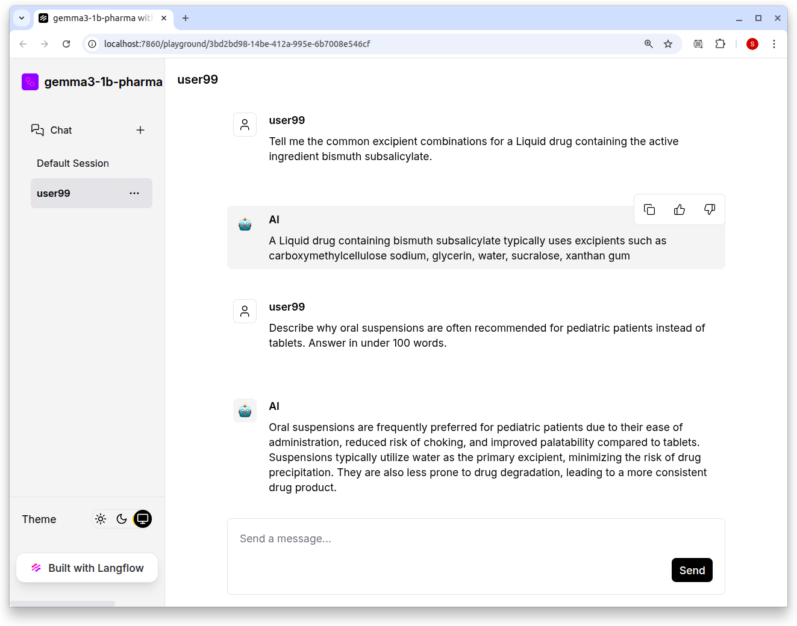
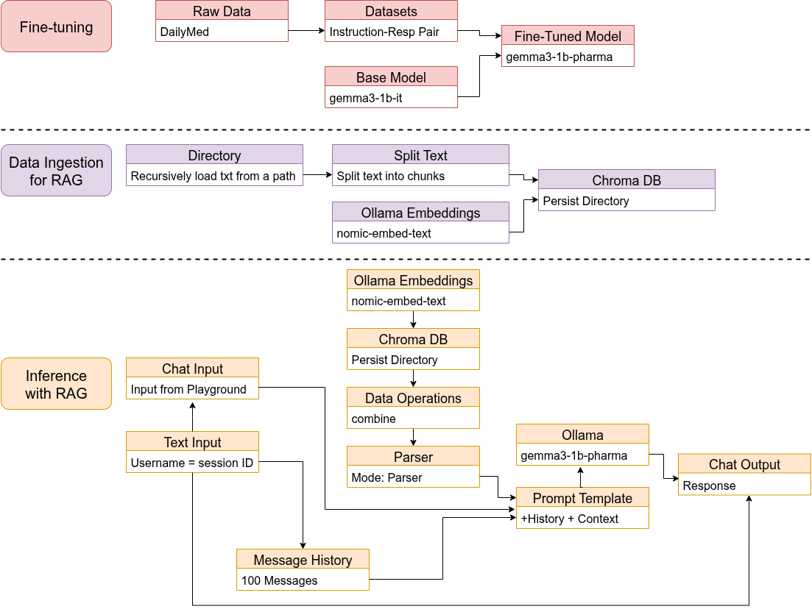
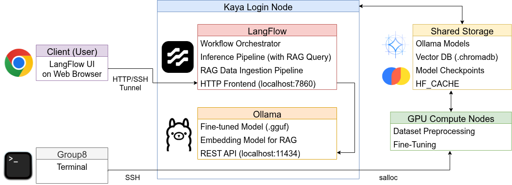

# CITS5553 Data Science Capstone Project (Group 8)

## AI-Driven Formulation Development for Pharmaceutical Applications

The final project for the CITS5553 unit. It looks at how a large language model can be
adapted to predict excipient combinations and formulation outcomes, instead of the usual
trial-and-error approach.

## Core components

* Data sources. External domain-specific text, mainly DailyMed, used for training and for
  the knowledge base.
* Foundation model. `google/gemma-3-1b-it` is the base LLM, adapted to the pharmaceutical
  domain.
* Method:
  - Fine-tuning with instruction-response pairs, to teach domain reasoning and
    instruction-following.
  - Retrieval-Augmented Generation (RAG) over a local vector database, which gives the
    model a structured knowledge base of domain documents and improves its predictions.
* Tasks the model is trained for:
  - selecting excipients
  - recommending candidate formulations
  - predicting formulation outcomes

## Key feature workflow

### File structure

* `clm/`: unsupervised fine-tuning (causal language modeling). This path did not work out,
  and is kept for the lessons learned.
    * `clm_training/`: scripts and log files used for CLM training.
    * `data_prep/`: code for downloading, sampling and preprocessing PubMed and DailyMed
      XML data.
    * `evaluation/`: quantitative and qualitative evaluation of the CLM-trained model.
    * `clm_training_samples.tar.gz`: archive with 2,466 sample files for CLM training.
    * `gemma3-1b-it-clm-trained.tar.gz`: archive with the latest checkpoint from the CLM
      training run.

* `data/`: the DailyMed dataset used for fine-tuning.
    * `full_database.csv`: CSV extracted from DailyMed with product, dosage form, route,
      active ingredient, active strength and inactive ingredients.
    * `train.txt`, `val.txt`, `test.txt`: training, validation and test sets generated from
      `full_database.csv` as instruction-response pairs for supervised fine-tuning.

* `docs/`: project proposal, final report and documentation, including the user guide.

* `evaluation/`: a model evaluation script. It evaluates the base, fine-tuned and
  RAG-enhanced models on BLEU, ROUGE, cosine similarity, precision, recall, top-K accuracy
  and perplexity, covering both linguistic coherence and semantic performance.

* `fine-tuning/`: the Jupyter notebook used for instruction-response fine-tuning of the
  base model.

* `langflow/`: the LangFlow + RAG workflow.
    * `gemma3-1b-pharma with RAG.json`: exported JSON defining the LangFlow pipeline.

* `ollama/`: deployment artifacts.
    * `gemma3-1b-pharma_q8_0.Modelfile`: the Modelfile used to package and run the
      fine-tuned model (`gemma3-1b-pharma`) on the Ollama inference server.

* `vector_DB/`: a Jupyter notebook for building the Chroma vector database, plus the
  retriever code used for RAG.

    Note: the actual implementation pipeline is configured in
    [LangFlow](./langflow/README.md).

## Deployment

The project needed large-scale data preparation and GPU training. With support from the UWA
HPC team, each group member received a Kaya account to share data and models and to run
jobs on the cluster. Clients can access Kaya as well, so the final system was deployed
there. Since hosting may change later, both the current setup and a portable path to
redeploy elsewhere are documented below.

### Current deployment on Kaya

The model was trained on Kaya GPU nodes, which allow at most 3 consecutive days per
allocation. To give clients a stable endpoint, the inference workflow (LangFlow + RAG +
Ollama) is hosted on the Kaya login node. Web service is then uninterrupted, at the cost of
somewhat lower throughput and higher latency than a dedicated GPU node would give.

Figure 3 shows the system deployed inside the UWA Kaya HPC environment:

* GPU nodes are allocated for training and fine-tuning.
* LangFlow + Ollama handle inference and user interaction on the login node.
* Chroma DB stores the vector embeddings for RAG.
* Clients reach the LangFlow Playground web UI through SSH tunneling.

After running the SSH tunneling command below from a local machine, the current version of
the model is reachable in a browser:

* Terminal: `ssh -N -f -L 7860:localhost:7860 userid@kaya01.hpc.uwa.edu.au`
* Web browser: `http://localhost:7860/playground/3bd2bd98-14be-412a-995e-6b7008e546cf`

### Future deployment on another machine

With the model on Kaya, clients do not need to install anything locally. However, once the
three-month project period allocated by the UWA HPC team ends, Kaya access goes away. The
client will then need to extend the server access period, run separate server
infrastructure, or install on individual machines. The local standalone deployment is the
simplest to reproduce, so it is documented step by step here.

#### 1) System requirements

* Linux/macOS (Windows WSL2 also works)
* 16-32 GB RAM, more is better
* Optional NVIDIA GPU + CUDA for faster Ollama inference

#### 2) Install prerequisites

* Python 3.10 to 3.13
* [miniconda](https://www.anaconda.com/docs/getting-started/miniconda/install)
* [LangFlow](./langflow/README.md)
* [Ollama](./ollama/README.md)
* Embedding model for RAG: `ollama pull nomic-embed-text`

#### 3) Bring project artifacts

* Fine-tuned model (.gguf) and [Modelfile](./ollama/gemma3-1b-pharma_q8_0.Modelfile)
* [LangFlow workflow file (.json)](./langflow/gemma3-1b-pharma with RAG.json). Import it
  via the LangFlow UI: Projects -> Upload a flow. Update any paths inside the components
  (directory loader path, ChromaDB persist directory and so on) to match the new machine.
* Vector DB: the packaged Chroma DB archive, for example
  [ChromaDB.tar.gz](./langflow/ChromaDB.tar.gz). Unpack it to the path used by your
  ChromaDB component's persist directory. If starting from scratch, run the ingestion flow
  to rebuild it.
* [Data files](./data/): rebuilding .chromadb from scratch needs the three dataset files
  for train, validation and test.

## Team members

* sarahp16: Sarah Pinelli (23419054)
* nishajha629: Nisha Jha (23945457)
* KoluzanovFE: Philipp Koluzanov (24069852)
* grail80: Sungbae Ji (24619726)
* shreyapatel2224: Shreya Kaushal Patel (24690749)

## License

Academic use only, not licensed for commercial use. All rights reserved.
